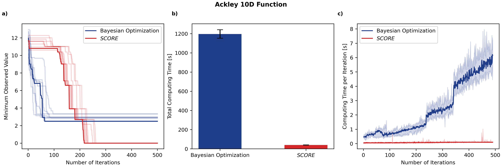

# SCORE

$SCORE$ is a technique I developed to overcome Bayesian Optimization’s curse of dimensionality in discrete parameter spaces, reducing computing time by up to 96% by reparameterizing the $N$-dimensional space into $N$ separate 1D spaces, one for each input variable. Unlike standard BO, where the Gaussian Process (GP) surrogate model become increasingly expensive to fit as more points are added (leading to cubic scaling of computing time with iterations, i.e. the curse of dimensionality), each 1D space in $SCORE$ has a fixed size, so the computational cost per iteration stays constant.

The working paper describing this approach can be found here: https://arxiv.org/abs/2406.12661

While Bayesian inference is powerful, it generally cannot scale to complex, high-dimensional problems and is typically limited to small, discrete parameter spaces. That's why I’ve been using $SCORE$ in my PV research, where it outperforms standard BO on real problems ranging from 10D to 19D. I’m currently benchmarking $SCORE$ against state-of-the-art algorithms, but the first Python implementation accompanying the working paper can be found here:https://github.com/hi-paris/SCORE.

  

  

