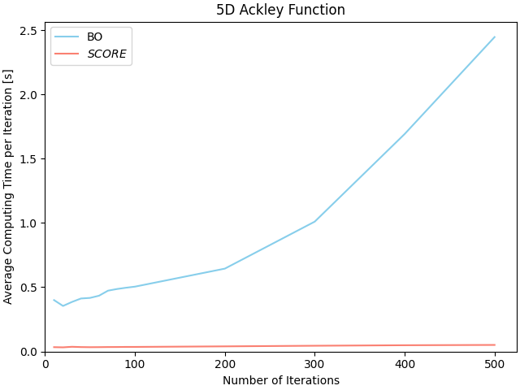

# SCORE
$SCORE$ is a 1D reparameterization technique that breaks Bayesian Optimization (BO)’s curse of dimensionality and drastically reduces its computing time by decomposing the full $N$-dimensional space into $N$ 1D spaces along each input variable. 

The working paper describing this approach can be found here: https://arxiv.org/abs/2406.12661

A Python implementation of SCORE is currently under development and available at: https://github.com/hi-paris/SCORE.

  

  

