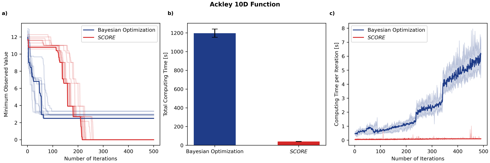

# SCORE

$SCORE$ is a technique I have developed to overcome Bayesian Optimization (BO)’s curse of dimensionality in practical applications. It can reduce BO’s computing time by up to 96% by reparameterizing the $N$-dimensional space into $N$ separate 1D spaces, one for each input variable. In standard BO, the Gaussian Process (GP) surrogate becomes increasingly expensive to fit as more points are added, leading to cubic scaling of computing time with iterations (i.e., the curse of dimensionality). In contrast, since each discretized 1D space in $SCORE$ has a fixed size, the computational cost per iteration remains constant.

A key advantage of this formulation is that by decoupling dimensions, $SCORE$ enables control of discretization resolution per parameter, allowing adaptive precision across the search space. This in turn naturally supports mixed-variable optimization problems with heterogeneous continuous, discrete, and categorical parameters, as commonly encountered in scientific problems - an extension that has not yet been explored in this work.

The working paper describing this approach can be found here: https://arxiv.org/abs/2406.12661

While Bayesian inference is powerful, it generally cannot scale to complex, high-dimensional problems and is typically limited to small, discrete parameter spaces. That's why I’ve been using $SCORE$ in my PV research, where it outperforms standard BO on real solar energy optimization problems ranging from 10D to 19D. I’m currently benchmarking $SCORE$ against state-of-the-art algorithms, but the first Python implementation accompanying the working paper can be found here: https://github.com/hi-paris/SCORE

  

  

